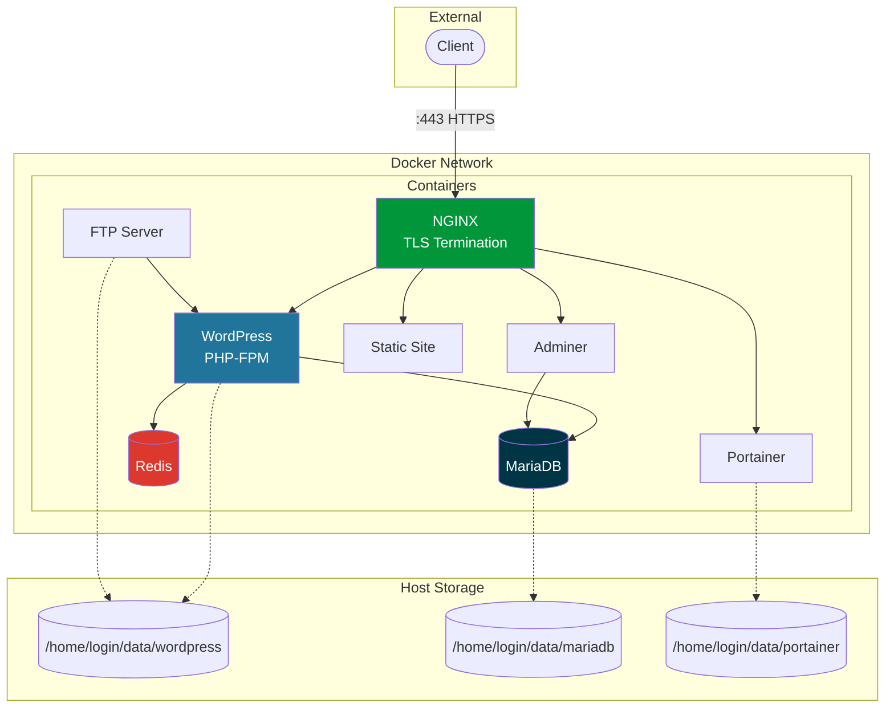

<h1 align="center">Inception</h1>

<p align="center">
  <strong>A containerized web infrastructure built from scratch</strong><br>
  System administration project for 42 School
</p>

<p align="center">
  
  
  
</p>

---

## 📋 Overview

Inception demonstrates infrastructure-as-code principles by building a complete web hosting stack using **custom Docker images** - no pre-built images from DockerHub. Each service runs in its own container, orchestrated with Docker Compose.

### Key Achievements

- 8 custom Dockerfiles built from `debian:bookworm`
- TLS-only access via NGINX reverse proxy (TLSv1.2/1.3)
- Docker Secrets for credential management
- Persistent volumes with host-mounted storage
- Complete bonus: Redis, Adminer, FTP, Portainer, Static Site

---

## 🏗️ Architecture



---

## 📦 Services

<table>
<tr>
<td width="50%">

### NGINX


Reverse proxy with TLS termination. Single entry point for all HTTPS traffic. Routes requests to appropriate backend services.

**Port:** 443

</td>
<td width="50%">

### WordPress


Content management system running with PHP-FPM. Connected to MariaDB for data persistence and Redis for object caching.

**URL:** `https://jsagaro-.42.fr`

</td>
</tr>
<tr>
<td width="50%">

### MariaDB


Relational database storing WordPress content. Configured with InnoDB engine for transactional support.

**Access:** Internal only

</td>
<td width="50%">

### Redis


In-memory cache for WordPress object caching. Improves page load performance by reducing database queries.

**Access:** Internal only

</td>
</tr>
<tr>
<td width="50%">

### Adminer


Lightweight database administration tool. Web interface for managing MariaDB tables, queries, and backups.

**URL:** `https://adminer.jsagaro-.42.fr`

</td>
<td width="50%">

### Portainer


Docker container management GUI. Monitor, start, stop, and inspect containers through web interface.

**URL:** `https://portainer.jsagaro-.42.fr`

</td>
</tr>
<tr>
<td width="50%">

### FTP Server


Secure file transfer access to WordPress files. Allows direct upload/download of themes, plugins, and media.

**Port:** 21

</td>
<td width="50%">

### Static Site


Personal portfolio website. Pure HTML/CSS/JS served directly by NGINX without backend processing.

**URL:** `https://static.jsagaro-.42.fr`

</td>
</tr>
</table>

---

## 🚀 Quick Start

```bash
# Clone and enter directory
git clone https://github.com/jsagaro-/inception.git
cd inception

# Setup secrets (create password files)
mkdir -p secrets
echo "secure_db_pass" > secrets/db_password.txt
echo "secure_root_pass" > secrets/db_root_password.txt
echo "secure_wp_admin" > secrets/wp_admin_password.txt
echo "secure_wp_user" > secrets/wp_user_password.txt
echo "secure_ftp_pass" > secrets/ftp_password.txt

# Add domains to hosts file
sudo tee -a /etc/hosts << EOF
127.0.0.1 jsagaro-.42.fr
127.0.0.1 adminer.jsagaro-.42.fr
127.0.0.1 static.jsagaro-.42.fr
127.0.0.1 portainer.jsagaro-.42.fr
EOF

# Build and launch
make all

# Access the site
open https://jsagaro-.42.fr
```

---

## 🛠️ Makefile Commands

| Command | Description |
|---------|-------------|
| `make all` | Build images and start containers |
| `make stop` | Pause containers (keep state) |
| `make start` | Resume paused containers |
| `make status` | Show container status |
| `make logs` | Stream real-time logs |
| `make clean` | Stop and remove containers |
| `make fclean` | Full cleanup (images, volumes, data) |
| `make re` | Rebuild from scratch |

---

## 📁 Project Structure

```
inception/
├── Makefile                    # Build orchestration
├── secrets/                    # Docker secrets (gitignored)
│   ├── db_password.txt
│   ├── db_root_password.txt
│   ├── wp_admin_password.txt
│   ├── wp_user_password.txt
│   └── ftp_password.txt
├── srcs/
│   ├── .env                    # Environment config
│   ├── docker-compose.yml      # Service definitions
│   └── requirements/
│       ├── nginx/              # Reverse proxy
│       ├── mariadb/            # Database
│       ├── wordpress/          # CMS + PHP-FPM
│       └── bonus/
│           ├── redis/          # Cache
│           ├── adminer/        # DB admin
│           ├── static/         # Portfolio
│           ├── ftp/            # File transfer
│           └── portainer/      # Container management
└── docs/                       # Documentation
    ├── README.md               # 42 evaluation version
    ├── USER_DOC.md             # User guide
    └── DEV_DOC.md              # Developer guide
```

---

## 🔒 Security

- **TLS 1.2/1.3 only** - No legacy SSL protocols
- **Docker Secrets** - Passwords never in environment variables
- **Single entry point** - Only NGINX exposed externally
- **Isolated network** - Bridge network with container DNS
- **No root passwords in images** - Secrets mounted at runtime

---

## 📚 Documentation

- [docs/README.md](docs/README.md) - Technical choices and 42 evaluation notes
- [docs/USER_DOC.md](docs/USER_DOC.md) - End-user operation guide
- [docs/DEV_DOC.md](docs/DEV_DOC.md) - Developer setup and maintenance

---

## 👤 Author

**jsagaro-** - 42 Madrid
