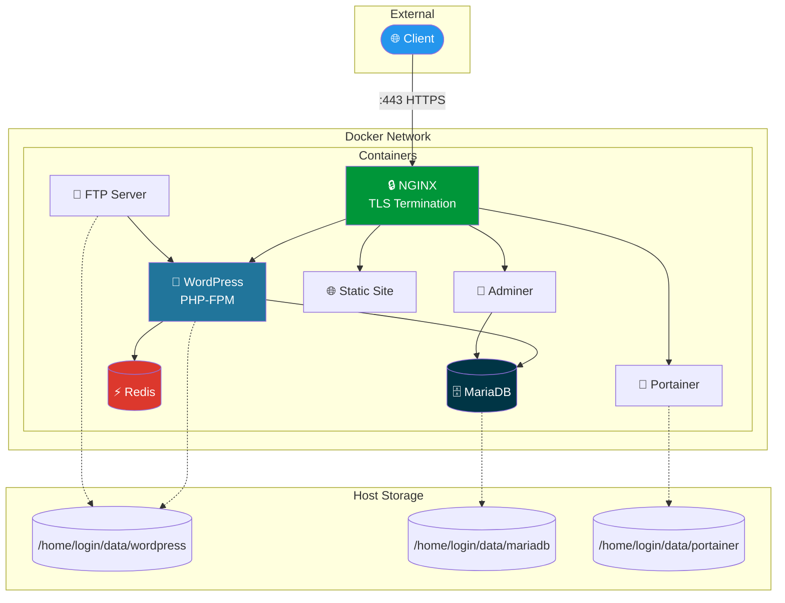

<p align="center">
  
  
  
  
  
  
</p>

<h1 align="center">🐳 Inception</h1>

<p align="center">
  <strong>A containerized web infrastructure built from scratch</strong><br>
  System administration project for 42 School
</p>

<p align="center">
  
  
  
</p>

---

## 📋 Overview

Inception demonstrates infrastructure-as-code principles by building a complete web hosting stack using **custom Docker images** - no pre-built images from DockerHub. Each service runs in its own container, orchestrated with Docker Compose.

### Key Achievements

- ✅ **8 custom Dockerfiles** built from `debian:bookworm`
- ✅ **TLS-only access** via NGINX reverse proxy (TLSv1.2/1.3)
- ✅ **Docker Secrets** for credential management
- ✅ **Persistent volumes** with host-mounted storage
- ✅ **Complete bonus** with Redis, Adminer, FTP, Portainer, and static site

---

## 🏗️ Architecture



---

## 🚀 Quick Start

```bash
# Clone and enter directory
git clone https://github.com/jsagaro-/inception.git
cd inception

# Setup secrets (create password files)
mkdir -p secrets
echo "secure_db_pass" > secrets/db_password.txt
echo "secure_root_pass" > secrets/db_root_password.txt
echo "secure_wp_admin" > secrets/wp_admin_password.txt
echo "secure_wp_user" > secrets/wp_user_password.txt
echo "secure_ftp_pass" > secrets/ftp_password.txt

# Add domain to hosts file
echo "127.0.0.1 jsagaro-.42.fr" | sudo tee -a /etc/hosts

# Build and launch
make all

# Access the site
open https://jsagaro-.42.fr
```

---

## 📦 Services

| Service | Description | Port |
|---------|-------------|------|
| **NGINX** | Reverse proxy, TLS termination, routing | 443 |
| **WordPress** | CMS with PHP-FPM | Internal |
| **MariaDB** | Relational database | Internal |
| **Redis** | Object cache for WordPress | Internal |
| **Adminer** | Database web UI | `/adminer` |
| **Portainer** | Docker management UI | `/portainer` |
| **FTP** | File transfer to WordPress | 21 |
| **Static** | Portfolio website | `/static` |

---

## 🛠️ Makefile Commands

| Command | Description |
|---------|-------------|
| `make all` | Build images and start containers |
| `make clean` | Stop and remove containers |
| `make fclean` | Full cleanup (images, volumes, data) |
| `make re` | Rebuild from scratch |
| `make status` | Show container status |
| `make logs` | Stream real-time logs |
| `make stop` | Pause containers |
| `make start` | Resume containers |

---

## 📁 Project Structure

```
inception/
├── Makefile                    # Build orchestration
├── secrets/                    # Docker secrets (gitignored)
│   ├── db_password.txt
│   ├── db_root_password.txt
│   ├── wp_admin_password.txt
│   ├── wp_user_password.txt
│   └── ftp_password.txt
├── srcs/
│   ├── .env                    # Environment config
│   ├── docker-compose.yml      # Service definitions
│   └── requirements/
│       ├── nginx/              # Reverse proxy
│       ├── mariadb/            # Database
│       ├── wordpress/          # CMS + PHP-FPM
│       └── bonus/
│           ├── redis/          # Cache
│           ├── adminer/        # DB admin
│           ├── static/         # Portfolio
│           ├── ftp/            # File transfer
│           └── portainer/      # Container management
└── docs/                       # Documentation
    ├── README.md               # 42 evaluation version
    ├── USER_DOC.md             # User guide
    └── DEV_DOC.md              # Developer guide
```

---

## 🔒 Security Features

- **TLS 1.2/1.3 only** - No legacy SSL protocols
- **Docker Secrets** - Passwords never in environment variables
- **Single entry point** - Only NGINX exposed externally
- **Isolated network** - Bridge network with container DNS
- **No root passwords in images** - Secrets mounted at runtime

---

## 📚 Documentation

For detailed information, see the `/docs` directory:

- [**docs/README.md**](docs/README.md) - Technical choices and 42 evaluation requirements
- [**docs/USER_DOC.md**](docs/USER_DOC.md) - End-user operation guide
- [**docs/DEV_DOC.md**](docs/DEV_DOC.md) - Developer setup and maintenance

---

## 👤 Author

**jsagaro-** - 42 Madrid

---

<p align="center">
  <sub>Built with ☕ and 🐳 at 42 Madrid</sub>
</p>
